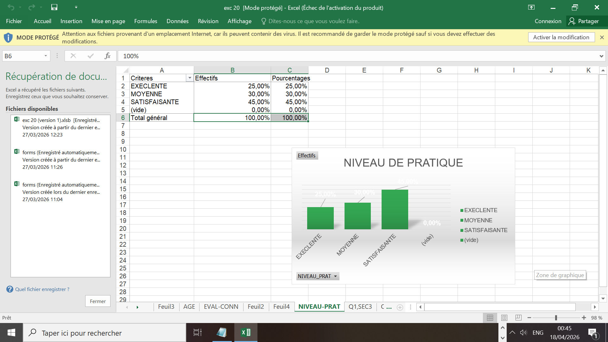
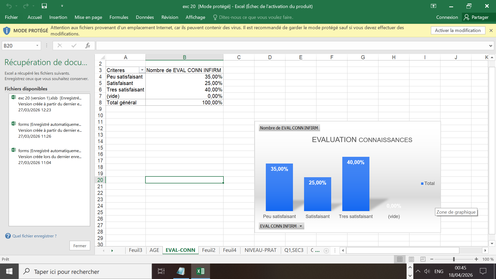
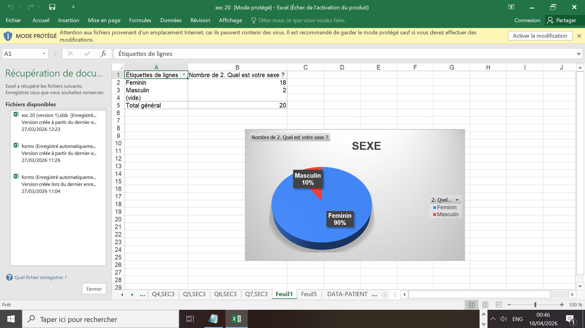
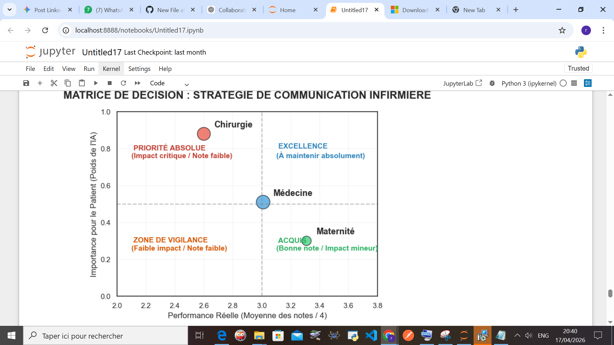

# Contribution Data : Analyse de la Communication Thérapeutique 

## Introduction
Ce projet s’inscrit dans le cadre d’une soutenance de **BTS en Sciences Infirmières**. Mon intervention a consisté à apporter un appui technique sur la gestion des données pour structurer et valoriser les données issues de son étude.

L'objectif était de transformer une collecte de terrain en indicateurs fiables, permettant ainsi à la candidate de se concentrer sur son expertise clinique tout en s'appuyant sur des supports statistiques solides.

## Une Collaboration Stratégique
Le projet repose sur une répartition claire des rôles :

* **Approche clinique (Soins infirmiers) :** Portée par l'étudiante, incluant la définition des problématiques, l’enquête de terrain et la structuration du contenu scientifique du mémoire.
* **Soutien Data (Collecte & Traitement) :** Ma contribution a porté sur la mise en place de la collecte via Google Forms, ainsi que le nettoyage et la structuration des données sous **Microsoft Excel**. Ces outils ont été les supports officiels utilisés lors de la soutenance.

## Le rôle de Python : Une "Sécurité" Technique
En amont de la soutenance, un script **Python** avait été initié afin d’explorer des analyses complémentaires et approfondir l’interprétation des données. L'idée était de disposer d'une analyse plus profonde "en réserve", prête à être mobilisée si le jury exigeait des précisions complexes sur la corrélation des données.

Bien que l'étudiante n'ait finalement pas eu besoin de ce support grâce à la clarté de sa présentation, j'ai choisi de **poursuivre ce développement après la soutenance**. Ce projet est donc devenu pour moi un cas d'étude concret pour appliquer des outils de Data Science à des données de santé réelles et montrer l'impact de l'automatisation.

## Visualisations du Projet

### 1. Supports de Soutenance (Excel)
Aperçu des graphiques et Tableaux Croisés Dynamiques (TCD) qui ont servi de base à l'argumentaire du mémoire pour transformer les données brutes en informations lisibles.

### 2. Extension Data Science (Python)
Ce tableau de bord représente la continuité du projet. Il a été développé pour approfondir l'analyse visuelle et explorer de nouvelles corrélations.

*Dashboard réalisé avec Matplotlib (Analyse post-soutenance).*

## Stack Technique
* **Outils de la Soutenance :** Google Forms & Microsoft Excel.
* **Outils d'Approfondissement Personnel :** Python (`Pandas`, `Matplotlib`).

## Vision
Ce travail démontre que la technologie est un levier puissant, qu'elle soit utilisée en première ligne (Excel) ou en préparation stratégique (Python). C'est une preuve de l'impact positif de la data pour accompagner et sécuriser des parcours académiques exigeants.

---
**Résultat :** Ce travail acharné a été récompensé par une mention **Très Bien avec les félicitations du jury**. Ce dépôt valorise l'investissement technique qui a contribué à ce succès.
